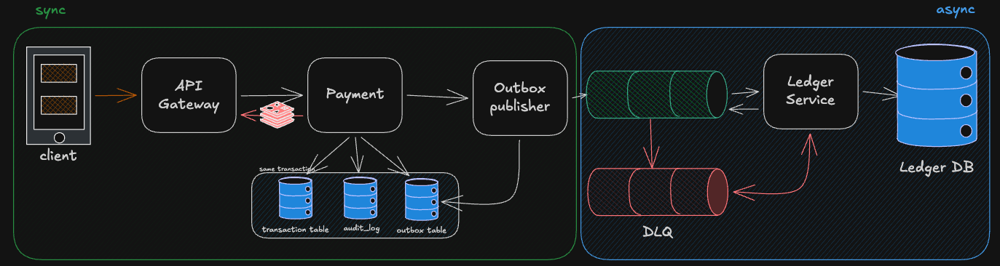
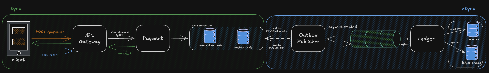
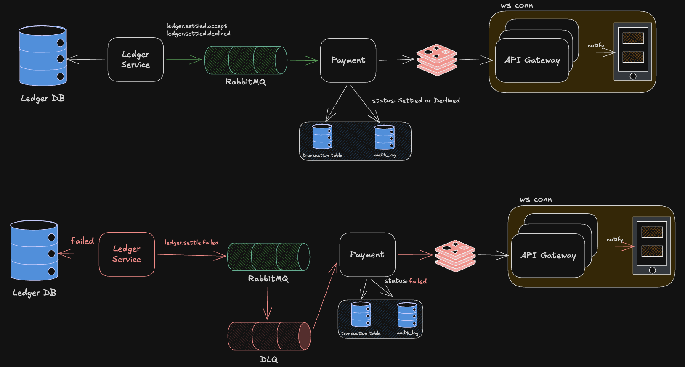

# Payment Service

A high-performance, cloud-native payment processing system built with Go, designed for scalability, resilience, and observability in production environments.



## 🚀 Overview

Payment Service is a microservices-based payment processing platform that handles payment creation, settlement, and real-time notifications. The system is designed with enterprise-grade patterns including event-driven architecture, distributed transactions, and comprehensive monitoring.

### Key Features

- **🏗️ Microservices Architecture**: Independent, scalable services with clear separation of concerns
- **⚡ High Performance**: Optimized for low latency and high throughput payment processing
- **🔄 Event-Driven**: Asynchronous processing with RabbitMQ for reliable message delivery
- **🛡️ Resilient**: Circuit breakers, retries, and graceful degradation patterns
- **📊 Observable**: Full OpenTelemetry instrumentation with distributed tracing
- **🔧 Cloud-Native**: Kubernetes-ready with horizontal pod autoscaling
- **🧪 Well-Tested**: Comprehensive test suite including unit, integration, and load tests

## 🏛️ Architecture

The system consists of three main microservices:

### Core Services

1. **API Gateway** - Entry point handling HTTP requests and WebSocket connections
2. **Payment Service** - Core business logic for payment processing and validation  
3. **Ledger Service** - Transaction recording and settlement processing



### Architecture Highlights

- **Async Processing**: Payment creation returns immediately while settlement happens asynchronously
- **Transactional Outbox**: Ensures reliable event publishing with database transactions
- **Event-Driven Integration**: Services communicate via RabbitMQ messaging
- **Audit Trail**: All payment changes are logged in append-only audit log
- **Circuit Breaker**: Prevents cascading failures across service boundaries
- **Distributed Tracing**: End-to-end request tracking across all services
- **Real-time Notifications**: WebSocket-based status updates to clients



## 🛠️ Technology Stack

### Backend
- **Go 1.25+** - Primary programming language
- **gRPC** - Inter-service communication with Protocol Buffers
- **PostgreSQL** - Primary data storage with separate databases per service
- **Redis** - Caching and session management
- **RabbitMQ** - Message broker for asynchronous processing

### Infrastructure
- **Kubernetes** - Container orchestration with HPA support
- **Docker** - Containerization and local development
- **Tilt** - Development workflow automation
- **Jaeger** - Distributed tracing and observability

### Testing & Monitoring
- **k6** - Load testing and performance validation
- **OpenTelemetry** - Metrics, traces, and logging
- **Testify** - Unit testing framework
- **GoMock** - Mock generation for testing

## 🚦 Getting Started

### Prerequisites

- Go 1.25+
- Docker
- [Minikube](https://minikube.sigs.k8s.io/docs/start/) - Local Kubernetes cluster
- [Tilt](https://tilt.dev/) - Kubernetes development environment
- [kubectl](https://kubernetes.io/docs/tasks/tools/) - Kubernetes CLI
- Make

### Quick Start with Kubernetes (Recommended)

The Payment Service is designed to run on Kubernetes from day one. Here's how to get started:

1. **Clone the repository**
   ```bash
   git clone https://github.com/LucasLCabral/payment-service.git
   cd payment-service
   ```

2. **Start Minikube**
   ```bash
   make minikube-start
   ```
   This starts Minikube with 4 CPUs and 8GB RAM - recommended for running all services.

3. **Launch development environment with Tilt**
   ```bash
   make tilt
   ```
   
   This will:
   - Build all Docker images with live reload
   - Deploy all services to Kubernetes
   - Set up databases with migrations
   - Configure networking and ingress
   - Open Tilt UI at http://localhost:10350

4. **Verify system health**
   ```bash
   # Get service URL from Minikube
   minikube service api-gateway --url
   
   # Test the API
   curl $(minikube service api-gateway --url)/health
   ```

### 🎯 Why Kubernetes + Tilt?

**Kubernetes-Native Development** gives you:
- **Production Parity**: Development environment matches production
- **Service Discovery**: Automatic DNS resolution between services
- **Resource Management**: CPU/Memory limits and requests
- **Scaling**: Test horizontal pod autoscaling locally
- **ConfigMaps & Secrets**: Proper configuration management

**Tilt Benefits**:
- **🔥 Live Reload**: Code changes instantly deployed
- **📊 Visual Dashboard**: Monitor all services in one place
- **🔧 Smart Rebuilds**: Only rebuild what changed
- **📝 Logs Aggregation**: Centralized logging from all pods
- **🚀 One Command**: Entire environment up with `make tilt`

### Alternative: Docker Compose (Simple Setup)

For simpler development without Kubernetes:

```bash
# Start infrastructure only
make docker-up

# Build and run services locally
make build
./bin/api-gateway &
./bin/payment-service &
./bin/ledger-service &
```

## 📊 Performance Testing

The project includes a comprehensive k6 test suite covering realistic usage patterns, end-to-end flows, stress scenarios, and chaos engineering. Full documentation in [`k6/README.md`](k6/README.md).

### Test Suites

| Suite | Command | Description |
|---|---|---|
| Realistic Load | `make k6-realistic` | Simulates real user patterns: PIX retail, TED corporate, e-commerce, mobile, Black Friday |
| End-to-End | `make k6-e2e` | Complete payment flow: creation → settlement → status validation |
| Stress | `make k6-stress` | Ramps up to 1000 VUs to find system breaking points |
| WebSocket | `make k6-websocket` | Real-time notification performance under concurrent connections |
| Chaos | `make k6-chaos` | Resilience under simulated failures (DB latency, network issues) |
| All | `make k6-all` | Full suite in sequence |

### Realistic Load Results (single-pod, local K8s)

Results from `make k6-realistic` with 122 VUs across 5 concurrent scenarios (24 minutes):

| Metric | Result |
|---|---|
| Success rate | **99.99%** (10374/10375 checks) |
| Avg latency | 6.4ms |
| p(90) latency | 9.79ms |
| p(95) latency | 12.37ms |
| p(95) Black Friday scenario | 10.09ms |
| p(95) Corporate TED | 17.89ms |
| Error rate | **0.02%** (1 out of 4911 requests) |

### Running Tests

```bash
# Recommended: run without K8s port-forward (more stable)
make docker-up
make k6-realistic

# Or inside the K8s cluster (eliminates port-forward overhead)
kubectl run k6 --image=grafana/k6 --rm -it -- run - < k6/realistic_load_test.js

# With K8s port-forward (may be unstable under high load)
make tilt          # environment up
make k6-realistic  # in another terminal
```

> **Note on stress tests and port-forward**: `make k6-stress` generates up to 15k req/s. The `kubectl port-forward` proxy can become unstable under this load — this is a local networking limitation, not a system failure. For accurate stress test results, run k6 directly inside the cluster.

## 🧪 Testing

### Unit Tests
```bash
make test                    # Run unit tests (fast, with -short flag)
make test-all                # Run all tests with race detection  
make test-coverage           # Generate coverage report (coverage.html)
```

**Testing approach:**
- ✅ **Unit tests**: Fast, reliable, isolated tests with mocks
- ✅ **Circuit Breaker tests**: Comprehensive state machine validation
- ✅ **HTTP handler tests**: Request/response validation with test servers
- ✅ **E2E tests**: Complete system validation with k6 load testing
```

### Integration Tests
```bash
make test-integration
```

### Test Coverage
```bash
make test-coverage
# Opens coverage.html in browser
```

### Benchmarks
```bash
make test-bench
```

## 🚀 Deployment

### Local Development (Minikube + Tilt)

The recommended way to run the Payment Service locally:

```bash
# 1. Start Minikube cluster
make minikube-start

# 2. Deploy everything with Tilt
make tilt

# 3. Check status
make minikube-status

# 4. Access services
minikube service api-gateway --url
```

**Tilt Dashboard**: http://localhost:10350
- Monitor all services
- View real-time logs
- Trigger manual rebuilds
- See resource usage

### Development Workflow

1. **Make code changes** - Tilt automatically detects and rebuilds
2. **Test endpoints** - Services are immediately available
3. **View logs** - Centralized logging in Tilt UI
4. **Debug issues** - kubectl commands work seamlessly

```bash
# Useful commands during development
kubectl get pods                    # Check pod status
kubectl logs -f deployment/payment-service  # Follow logs
kubectl port-forward svc/api-gateway 8080:80  # Direct port access
```

### Production Deployment

For production environments, use the Kubernetes manifests:

```bash
# Deploy to production cluster
kubectl apply -f deployments/k8s/

# Scale services
make k8s-scale SCALE_REPLICAS=5

# Enable CPU/Memory autoscaling for api-gateway
kubectl apply -f deployments/k8s/api-gateway-hpa.yaml

# Enable queue-depth autoscaling via KEDA (requires KEDA operator)
# kubectl apply -f https://github.com/kedacore/keda/releases/latest/download/keda-2.16.0.yaml
# KEDA_ENABLED=1 kubectl apply -f deployments/k8s/keda.yaml
```

### Environment Configuration

The system supports multiple environments:

- **Development**: Minikube + Tilt with hot reload
- **Staging**: Kubernetes cluster with reduced resources  
- **Production**: Full Kubernetes deployment with HPA and monitoring

## 📈 Monitoring & Observability

### Metrics
- Request latency and throughput
- Payment success/failure rates
- Business metrics (volume, transaction counts)
- System resources (CPU, memory, connections)

### Tracing
- End-to-end request tracing
- Service dependency mapping
- Performance bottleneck identification

### Logging
- Structured logging with correlation IDs
- Error tracking and alerting
- Business event audit trail

### Local Monitoring with Minikube

When running with Tilt, you get built-in observability:

**Tilt Dashboard** (http://localhost:10350):
- Real-time service status
- Build and deployment logs
- Resource consumption
- Port forwards and service URLs

**Kubernetes Dashboard**:
```bash
minikube dashboard  # Opens in browser
```

**Jaeger Tracing** (if enabled):
```bash
kubectl port-forward svc/jaeger 16686:16686
# Access at http://localhost:16686
```

**Direct Service Access**:
```bash
# Get service URLs
minikube service list

# Access API Gateway  
minikube service api-gateway --url

# Port forward for specific services
kubectl port-forward svc/payment-service 8081:80
```

## 🏆 Quality Attributes

### Scalability
- **Horizontal scaling**: Services scale independently based on load
- **Database sharding**: Separate databases prevent bottlenecks
- **Async processing**: Non-blocking operations maintain responsiveness

### Resilience
- **Circuit breakers**: Prevent cascade failures
- **Graceful degradation**: System remains functional under partial failures
- **Retry mechanisms**: Automatic recovery from transient failures

### Performance
- **Low latency**: P95 < 20ms for payment creation (single-pod, local K8s)
- **High throughput**: 1000+ payments/second per instance
- **Efficient resource usage**: Optimized DB connection pool, gRPC multiplexing

### Security
- **Input validation**: Comprehensive request validation
- **Audit logging**: Complete transaction history
- **Secure communication**: TLS encryption for all inter-service communication

## 🔧 Development Tools

### Minikube Commands

```bash
# Cluster management
make minikube-start           # Start with recommended resources
make minikube-stop            # Stop cluster
make minikube-status          # Check cluster status

# Useful Minikube commands
minikube dashboard            # Open Kubernetes dashboard
minikube tunnel               # Enable LoadBalancer services
minikube addons list          # See available addons
minikube ssh                  # SSH into Minikube node
```

### Tilt Commands

```bash
make tilt                     # Start development environment
make tilt-down                # Stop and cleanup
make tilt-ci                  # Run in CI mode (non-interactive)

# Tilt CLI commands (if needed)
tilt logs payment-service     # View specific service logs  
tilt trigger payment-service  # Force rebuild specific service
```

### Troubleshooting

**Minikube Issues:**
```bash
# Clean restart
minikube delete && make minikube-start

# Check resources
minikube status
kubectl top nodes

# View cluster events
kubectl get events --sort-by=.metadata.creationTimestamp
```

**Tilt Issues:**
```bash
# Clean rebuild
make tilt-down && make tilt

# Check Tilt logs
tilt logs --follow

# Manual kubectl access
kubectl get pods -A
kubectl describe pod <pod-name>
```

**Service Connection Issues:**
```bash
# Port forward to access services directly
kubectl port-forward svc/api-gateway 8080:80
kubectl port-forward svc/payment-service 8081:80

# Check service endpoints
kubectl get endpoints
minikube service list
```

## 📋 API Documentation

### Payment Creation
```bash
POST /payments
Content-Type: application/json

{
  "idempotency_key": "unique-key",
  "amount_cents": 10000,
  "currency": "USD",
  "payer_id": "user-123",
  "payee_id": "user-456",
  "description": "Payment description"
}
```

### Payment Status
```bash
GET /payments/{payment_id}
```

### Real-time Updates
```bash
WebSocket: ws://localhost:8080/ws?payment_id={payment_id}
```

## 🤝 Contributing

1. Fork the repository
2. Create a feature branch (`git checkout -b feature/amazing-feature`)
3. Run tests (`make test`)
4. Commit changes (`git commit -m 'Add amazing feature'`)
5. Push to branch (`git push origin feature/amazing-feature`)
6. Open a Pull Request

## 📝 License

This project is licensed under the MIT License - see the [LICENSE](LICENSE) file for details.

---